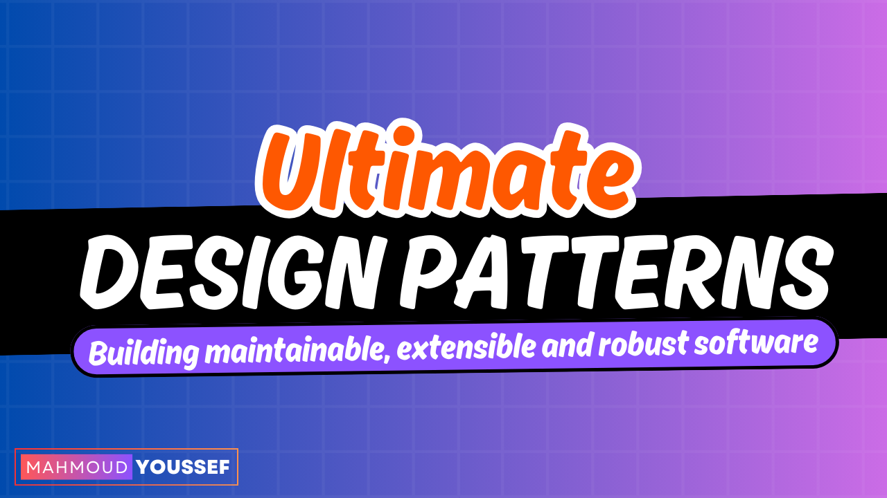

# ultimate-design-patterns

Mastering classical design patterns with practical examples in the ultimate design patterns bundle.

  

## How to Contribute

Feel free to contriubte by applying theses patterns in different programming languages as well as we are open for any enhancements through pull requests.

## Contributors

Thanks to all the people who already contributed!

| Name           | Contribution     | GitHub Avatar                                     |
|----------------|------------------|---------------------------------------------------|
| Hatem Hosny    | Typescript       |  |
| Mohamed Lotfy  | Typescript       | |
| Amir Elsagan   | C#               | |
| Moamen Ashraf  | C#               | |
| Youssef Wael   | C#               | |
| Ahmed Mahdy    | Dart             | |
| Rodina Moamen  | Kotlin           | |
| Abdelrahman Kosba  | Java           | |

## License

This project is licensed under the terms of the MIT license.
