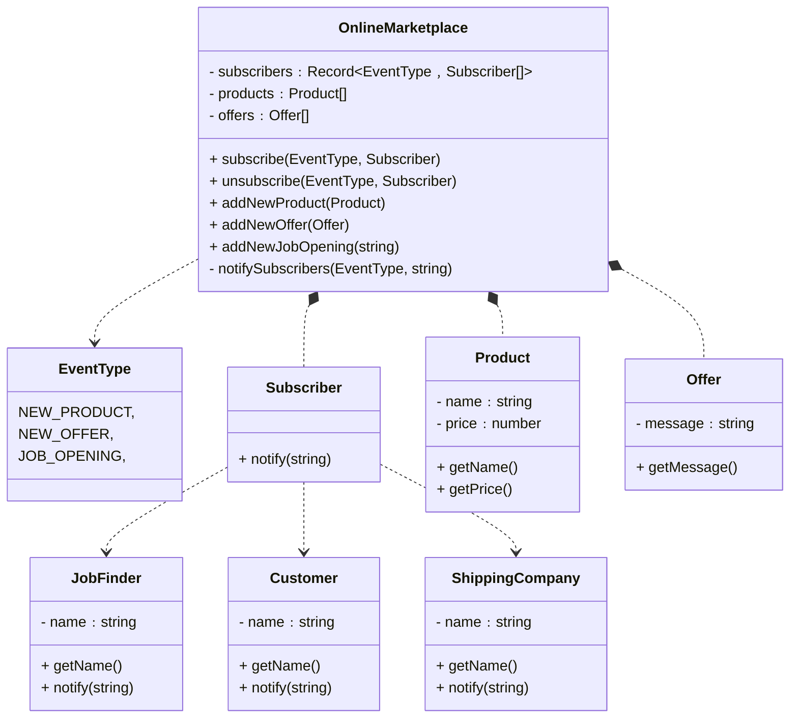

# Observer Pattern

```mermaid
classDiagram
  OnlineMarketplace ..> EventType
  OnlineMarketplace *.. Subscriber
  OnlineMarketplace *.. Product
  OnlineMarketplace *.. Offer
  Subscriber ..> JobFinder
  Subscriber ..> Customer
  Subscriber ..> ShippingCompany

  OnlineMarketplace : - subscribers﹕Record~EventType﹐Subscriber[]~
  OnlineMarketplace : - products﹕Product[]
  OnlineMarketplace : - offers﹕Offer[]
  OnlineMarketplace : + subscribe(EventType, Subscriber)
  OnlineMarketplace : + unsubscribe(EventType, Subscriber)
  OnlineMarketplace : + addNewProduct(Product)
  OnlineMarketplace : + addNewOffer(Offer)
  OnlineMarketplace : + addNewJobOpening(string)
  OnlineMarketplace : - notifySubscribers(EventType, string)

  EventType : NEW_PRODUCT,
  EventType : NEW_OFFER,
  EventType : JOB_OPENING,

  Subscriber: + notify(string)

  Product: - name﹕string
  Product: - price﹕number
  Product: + getName()
  Product: + getPrice()

  Offer: - message﹕string
  Offer: + getMessage()

  Customer: - name﹕string
  Customer: + getName()
  Customer: + notify(string)

  JobFinder: - name﹕string
  JobFinder: + getName()
  JobFinder: + notify(string)

  ShippingCompany: - name﹕string
  ShippingCompany: + getName()
  ShippingCompany: + notify(string)
```
