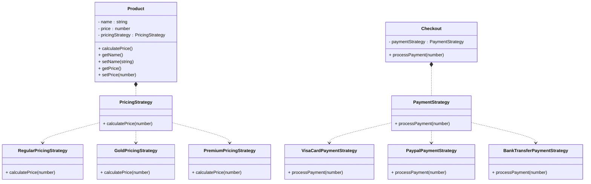

# Strategy Pattern

```mermaid
classDiagram
  Product *.. PricingStrategy
  PricingStrategy ..> RegularPricingStrategy
  PricingStrategy ..> GoldPricingStrategy
  PricingStrategy ..> PremiumPricingStrategy
  Checkout *.. PaymentStrategy
  PaymentStrategy ..> VisaCardPaymentStrategy
  PaymentStrategy ..> PaypalPaymentStrategy
  PaymentStrategy ..> BankTransferPaymentStrategy

  PricingStrategy: + calculatePrice(number)

  PaymentStrategy: + processPayment(number)

  RegularPricingStrategy: + calculatePrice(number)

  GoldPricingStrategy: + calculatePrice(number)

  PremiumPricingStrategy: + calculatePrice(number)

  VisaCardPaymentStrategy: + processPayment(number)

  PaypalPaymentStrategy: + processPayment(number)

  BankTransferPaymentStrategy: + processPayment(number)

  Product: - name﹕string
  Product: - price﹕number
  Product: - pricingStrategy﹕PricingStrategy
  Product: + calculatePrice()
  Product: + getName()
  Product: + setName(string)
  Product: + getPrice()
  Product: + setPrice(number)

  Checkout: - paymentStrategy﹕PaymentStrategy
  Checkout: + processPayment(number)
```
