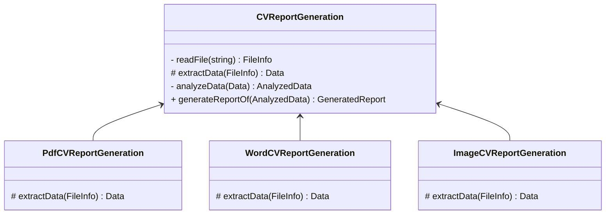

# Template Pattern

```mermaid
classDiagram
  CVReportGeneration <-- PdfCVReportGeneration
  CVReportGeneration <-- WordCVReportGeneration
  CVReportGeneration <-- ImageCVReportGeneration

  CVReportGeneration: - readFile(string) FileInfo
  CVReportGeneration: # extractData(FileInfo) Data
  CVReportGeneration: - analyzeData(Data) AnalyzedData
  CVReportGeneration: + generateReportOf(AnalyzedData) GeneratedReport

  PdfCVReportGeneration: # extractData(FileInfo) Data
  WordCVReportGeneration: # extractData(FileInfo) Data
  ImageCVReportGeneration: # extractData(FileInfo) Data
```
